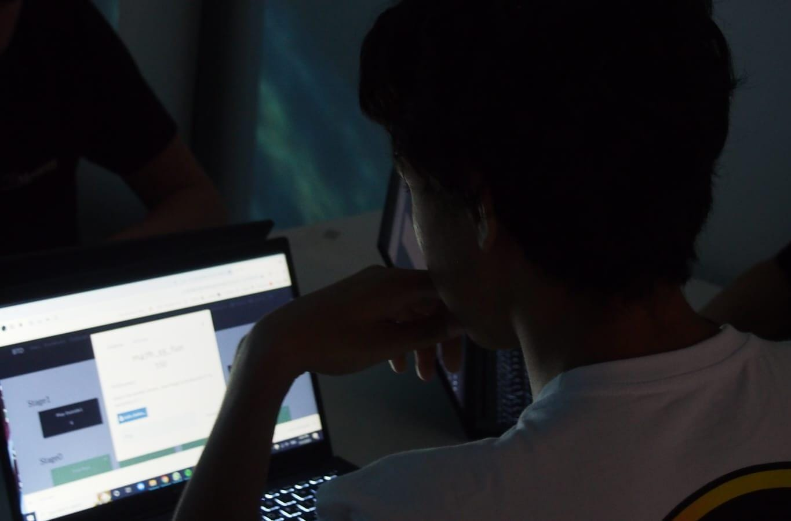

# 🌟 Uri Austin - Portfolio Website

A modern, responsive portfolio website showcasing my projects, skills, and professional experience as a developer and Magshimist.



## 📋 Table of Contents

- [Overview](#overview)
- [Features](#features)
- [Technologies Used](#technologies-used)
- [Installation](#installation)
- [Project Structure](#project-structure)
- [Customization](#customization)
- [Responsive Design](#responsive-design)
- [Browser Support](#browser-support)
- [Performance](#performance)
- [License](#license)
- [Contact](#contact)

## 🎯 Overview

This is a professional portfolio website built with vanilla HTML, CSS, and JavaScript. It features a clean, modern design with smooth animations, full responsiveness, and an intuitive user experience. The website is designed to showcase my technical skills, projects, and provide easy ways for potential collaborators or employers to get in touch.

**Live Demo**: [Your GitHub Pages URL]

## ✨ Features

### Core Features
- 📱 **Fully Responsive**: Optimized for all devices (mobile, tablet, desktop)
- 🎨 **Modern UI/UX**: Clean, professional design with smooth animations
- ⚡ **Fast Performance**: Lightweight, optimized code with minimal dependencies
- ♿ **Accessible**: Semantic HTML and ARIA labels for better accessibility
- 🎭 **Interactive**: Engaging animations and hover effects
- 🌐 **SEO Optimized**: Proper meta tags and structured content

### Sections
1. **Home/Hero Section**
   - Eye-catching introduction
   - Animated typing effect
   - Social media links
   - Call-to-action buttons

2. **About Section**
   - Professional bio
   - Statistics counter (technologies, projects, experience)
   - Core values display
   - Personal philosophy

3. **Skills Section**
   - Organized by categories (Programming Languages, Web Development, Tools)
   - Visual skill level indicators
   - Animated progress bars
   - Skill descriptions
   - Inspirational quote

4. **Projects Section**
   - Grid-based project showcase
   - Color-coded status badges
   - Technology tags
   - Direct links to GitHub repositories

5. **Contact Section**
   - Multiple contact methods
   - Card-based layout
   - Social media integration
   - Professional call-to-action

### Interactive Elements
- ✅ Mobile hamburger menu
- ✅ Smooth scroll navigation
- ✅ Active section highlighting
- ✅ Scroll-triggered animations
- ✅ Animated skill bars
- ✅ Statistics counter animation
- ✅ Typing effect
- ✅ Hover effects on cards and buttons

## 🛠️ Technologies Used

### Frontend
- **HTML5** - Semantic markup
- **CSS3** - Modern styling with CSS Grid & Flexbox
- **JavaScript (ES6+)** - Interactive functionality
- **Boxicons** - Icon library

### Features & Techniques
- CSS Variables for theming
- CSS Grid & Flexbox for layouts
- Intersection Observer API for scroll animations
- Mobile-first responsive design
- BEM methodology for CSS organization

## 📦 Installation

### Prerequisites
- A modern web browser
- A text editor (VS Code, Sublime Text, etc.)
- Optional: A local server for testing

### Quick Start

1. **Clone the repository**
   ```bash
   git clone https://github.com/AustinUri/AustinUri.github.io.git
   cd AustinUri.github.io
   ```

2. **Open the website**
   - Simply open `index.html` in your web browser
   - Or use a local server:
     ```bash
     # Using Python
     python -m http.server 8000
     
     # Using Node.js
     npx serve
     
     # Using PHP
     php -S localhost:8000
     ```

3. **View in browser**
   - Navigate to `http://localhost:8000` (if using a server)
   - Or just double-click `index.html`

## 📁 Project Structure

```
portfolio/
│
├── index.html          # Main HTML file
├── styles.css          # All CSS styles
├── script.js           # JavaScript functionality
├── README.md           # This file
│
├── Images/
│   ├── img.jpg         # Profile picture
│   ├── asm.png         # Assembly icon
│   ├── Csharp-icon.png # C# icon
│   ├── rust.png        # Rust icon
│   ├── sql-server.png  # SQL icon
│   └── json.png        # JSON icon
│
└── Assets/             # (Optional) Additional resources
```

## 🎨 Customization

### Changing Colors

Edit the CSS variables in `styles.css`:

```css
:root {
    --primary-color: #00abf0;      /* Main accent color */
    --secondary-color: #bf0fbc;    /* Secondary accent */
    --accent-color: #fa8072;       /* Highlight color */
    --dark-bg: #031540;            /* Dark background */
    --light-bg: #ffffff;           /* Light background */
    /* ... more variables ... */
}
```

### Adding New Projects

In `index.html`, add a new project card in the projects section:

```html
<div class="project">
    <div class="project-header">
        <h3>Project Name</h3>
        <span class="status-badge finished">Finished</span>
    </div>
    <p class="project-description">Project description here...</p>
    <div class="technologies">
        <span class="tech-tag"><i class='bx bxl-javascript'></i> JavaScript</span>
    </div>
    <div class="project-footer">
        <a href="https://github.com/..." class="btn btn-project">
            <i class='bx bx-code-alt'></i> View Code
        </a>
    </div>
</div>
```

### Adding New Skills

Add a new skill card in the appropriate category:

```html
<div class="skill" data-skill="intermediate">
    <i class='bx bxl-react'></i>
    <h4>React</h4>
    <div class="skill-level">
        <div class="skill-bar" style="width: 75%"></div>
    </div>
    <p class="skill-desc">Modern frontend framework</p>
</div>
```

### Updating Personal Information

1. **Profile Image**: Replace `img.jpg` with your photo
2. **Bio**: Edit the content in the About section
3. **Social Links**: Update URLs in the header and contact sections
4. **Projects**: Add/remove project cards as needed
5. **Skills**: Modify skill levels and add new technologies

## 📱 Responsive Design

The website is fully responsive with breakpoints for:

| Breakpoint | Screen Size | Target Devices |
|------------|-------------|----------------|
| Desktop | 1024px+ | Large screens, desktops |
| Tablet | 768px - 1024px | Tablets, small laptops |
| Mobile | 480px - 768px | Smartphones (landscape) |
| Small Mobile | 360px - 480px | Smartphones (portrait) |
| Extra Small | < 360px | Small smartphones |

### Key Responsive Features
- ✅ Hamburger menu on mobile
- ✅ Stacked layouts on smaller screens
- ✅ Flexible grid systems
- ✅ Touch-friendly buttons and links
- ✅ Optimized font sizes for readability
- ✅ Adaptive spacing and padding

## 🌐 Browser Support

Tested and working on:

- ✅ Chrome (latest)
- ✅ Firefox (latest)
- ✅ Safari (latest)
- ✅ Edge (latest)
- ✅ Opera (latest)

### Notes
- Internet Explorer is not supported (uses modern CSS features)
- For best experience, use an evergreen browser

## ⚡ Performance

### Optimization Features
- Minimal external dependencies (only Boxicons)
- Efficient CSS with CSS Grid and Flexbox
- Lazy loading for scroll animations
- Optimized images
- Clean, semantic HTML
- No heavy frameworks

### Performance Metrics
- **First Contentful Paint**: < 1s
- **Time to Interactive**: < 2s
- **Total Bundle Size**: < 100KB (excluding images)

### Tips for Better Performance
1. Compress images before uploading
2. Use WebP format for images
3. Enable caching on your server
4. Minify CSS and JavaScript for production
5. Use a CDN for better global performance

## 🚀 Deployment

### GitHub Pages (Recommended)

1. Push your code to GitHub
2. Go to repository Settings
3. Navigate to Pages section
4. Select main branch as source
5. Your site will be available at `https://username.github.io/repository-name/`

### Other Hosting Options
- **Netlify**: Drag and drop deployment
- **Vercel**: Connect your GitHub repo
- **AWS S3**: Host as a static website
- **Firebase Hosting**: Google's hosting solution

## 🔧 Troubleshooting

### Common Issues

**Mobile menu not working**
- Check that JavaScript is enabled
- Ensure `script.js` is properly linked
- Clear browser cache

**Animations not showing**
- Check browser compatibility
- Ensure JavaScript is running
- Verify Intersection Observer support

**Images not loading**
- Verify image paths are correct
- Check file names match exactly (case-sensitive)
- Ensure images are in the same directory

**Styling issues**
- Clear browser cache
- Check `styles.css` is properly linked
- Verify CSS syntax

## 📄 License

This project is open source and available under the [MIT License](LICENSE).

You are free to:
- ✅ Use this template for your own portfolio
- ✅ Modify and customize it
- ✅ Share it with others

Please provide attribution by linking back to the original repository.

## 🤝 Contributing

Contributions, issues, and feature requests are welcome!

1. Fork the project
2. Create your feature branch (`git checkout -b feature/AmazingFeature`)
3. Commit your changes (`git commit -m 'Add some AmazingFeature'`)
4. Push to the branch (`git push origin feature/AmazingFeature`)
5. Open a Pull Request

## 📬 Contact

**Uri Austin**

- 📧 Email: [austinuri2006@gmail.com](mailto:austinuri2006@gmail.com)
- 💬 Discord: [Join my server](https://discord.gg/CTFaN9JX6j)
- 📸 Instagram: [@austinuri2006](https://www.instagram.com/austinuri2006/)
- 💻 GitHub: [@AustinUri](https://github.com/AustinUri)

## 🙏 Acknowledgments

- **Boxicons** - For the beautiful icon library
- **Google Fonts** - For the Poppins font family
- **Inspiration** - Various portfolio designs from the web development community

---

**Made with ❤️ by Uri Austin**

*"In the end, it's not the years in your life that count. It's the life in your years." - Abraham Lincoln*